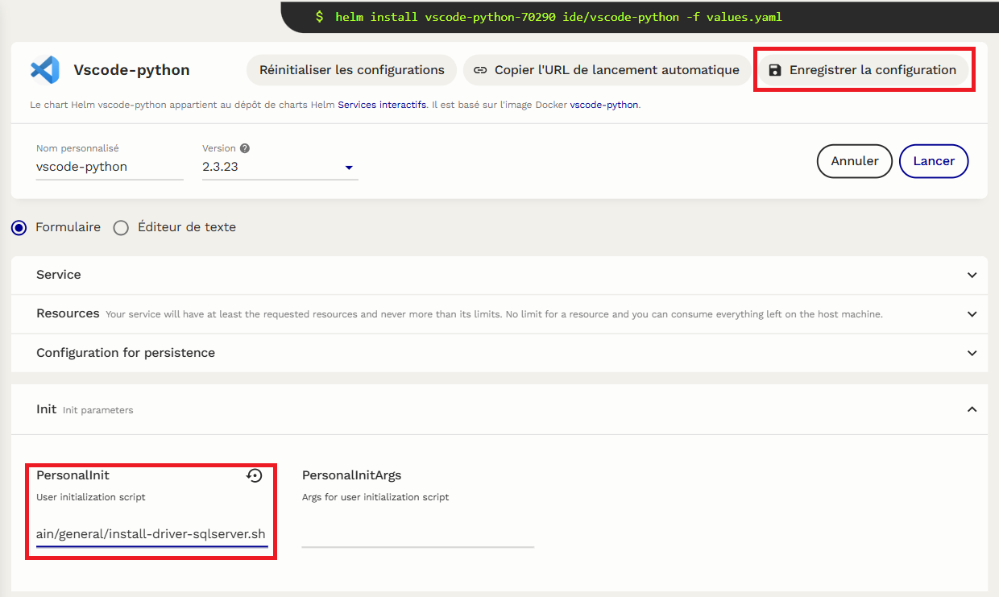

#  Scripts d'initialisation pour le datalab France.Sport

Ce repository contient des scripts pour initialiser une instance du datalab France.Sport.
Il y a d'autres scripts disponibles sur le [Github de l'INSEE](https://github.com/InseeFrLab/sspcloud-init-scripts).


## Comment utiliser un script d'initialisation
1. Vérifiez que le repository contenant le script est bien public.

2. Récupérez le [raw url](https://docs.github.com/en/repositories/working-with-files/using-files/viewing-a-file#viewing-or-copying-the-raw-file-content) du script à utiliser.


3. Au moment de lancer une instance, allez dans l'onglet Init et coller l'url du script.



4. Vous pouvez sauvegarder cette configuration pour ne plus avoir à faire ces étapes.

5. Lancez l'instance.


## Contributions

N'hésitez pas à contribuer en soumettant des pull requests.
Assurez-vous que les scripts sont bien documentés et respectent le template suivant :

```
#!/bin/sh

# Ce script ... 
# Paramètres attendus : 
# Mettre None si le script ne prend pas de paramètres, sinon :
#   - parameter1 : brève description
#   - parameter2 : brève description
```
